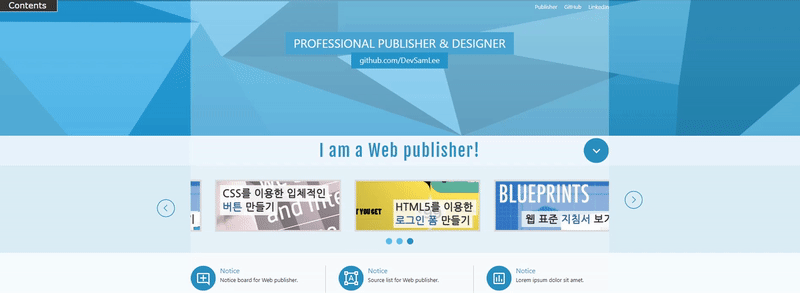
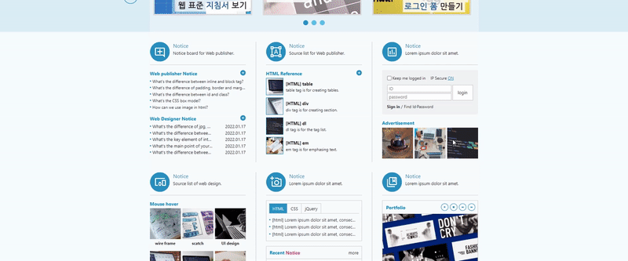

# StandardWeb2
> This repository is for tutorials of standard website.
>
> Link : https://youtube.com/playlist?list=PL4UVBBIc6giKixok-bC7XVEx0ZFsngr5Z (in Korean)

<!-- CONTENTS -->
## Contents
* HTML / CSS (and a little bit of jQuery)

## Overview

| Tab menu for mouse users :raising_hand: |  
|---------------------|
|  |

| IR effect for Screen Reader :headphones: |
|---------------------|
| |

| Sliding menu | 
|---------------------|
|  |

| Slick wheel menu * Link: https://kenwheeler.github.io/slick/ | 
|---------------------|
|  |

| Layer Popup     | 
|---------------------|
|  |

| Window Popup     | 
|---------------------|
|  |

| Screen Popup     | 
|---------------------|
|  |

| Mouse Hover     | portfolio   |  Tab menu     | 
|---------------------|--------------------|---------------------|
|  |  |  |

| Succeed in validator checks the markup validity of Web documents in HTML, XHTML, CSS 👍  | 
|---------------------|
|  |

<!-- CONTACT -->
## Contact

Sam Lee - [@LinkedIn](https://www.linkedin.com/in/sam-lee-343862155/) - LeeSam235711@gmail.com

(<a href="#top">back to top</a>)

